# Challenge-Alura-Store

# Descripción del Proyecto

Primer Challenge de la especialización en Ciencia de Datos del programa Oracle Next Education. El Challenge consiste en ayudar al Sr. Juan a decidir que tienda de su cadena
Alura Strore debe vender para inciar un nuevo emprendimiento, para ello se analizo un total de de datos de ventas, rendimiento y reseñas de las cuatro tiendas, 
haciendo uso de la ciencia de datos para brindar al Sr. Juan la opción mas acorde a su necesidad 

# :hammer:Secciones del analisis

- `Importación de Datos`: se realiza la importación de los datos

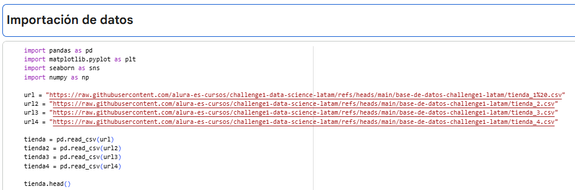

- `Sección 1`: Analisis de facturación: en esta sección se realiza la suma total de las ventas para cada tienda, de esta forma sabiendo cual es la tienda que tiene un mayor numero de ventas.

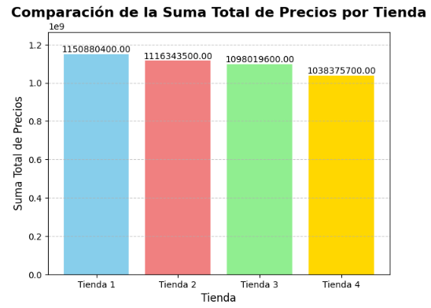

- `Sección 2`: Se realiza un analisis por categoria de productos, segun cada tienda

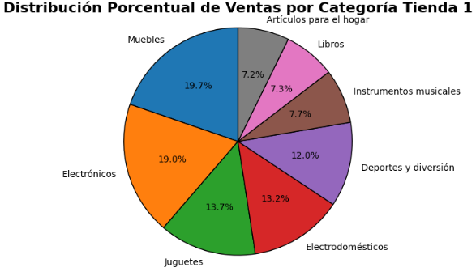 

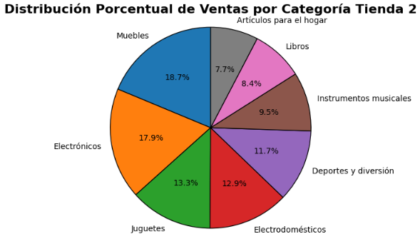 

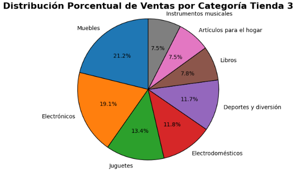 

- `Sección 3`: Se realiza el analisis de la calificación promedio por cada tienda

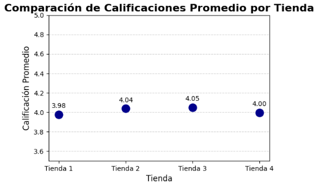

- `Sección 4`: Se realiza un analisis de los productos mas y menos vendidos para cada tienda

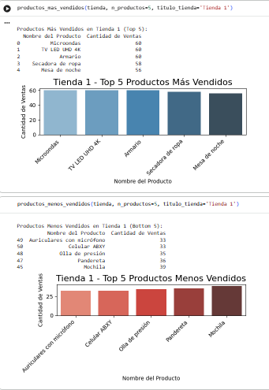

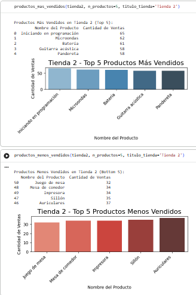

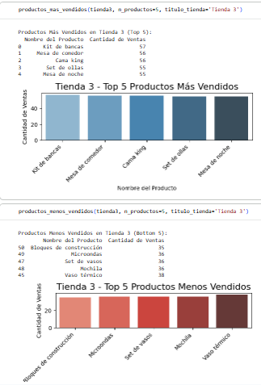

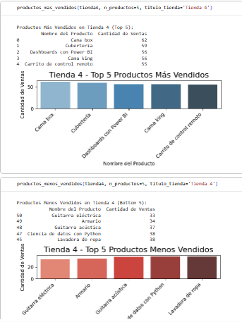

- `Sección 5`: Se realiza un analisis de los envios promedio por tienda
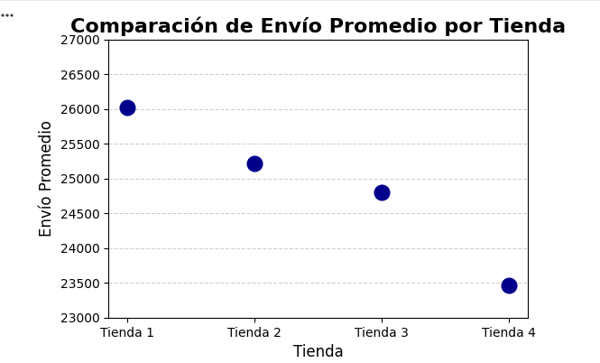

# Autor

| [ Elier Antonio Sulbará Rodríguez](https://github.com/ElierSul) 
